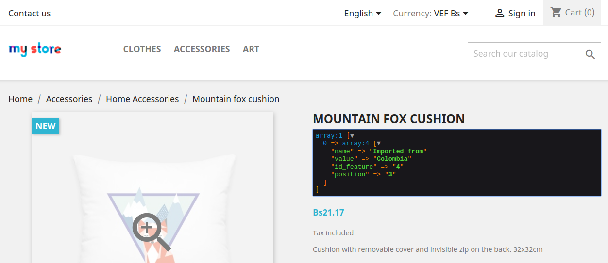
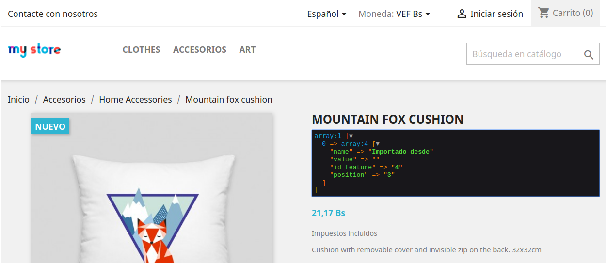
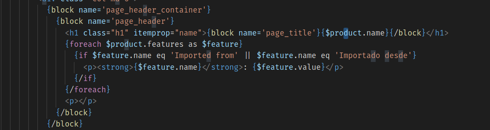
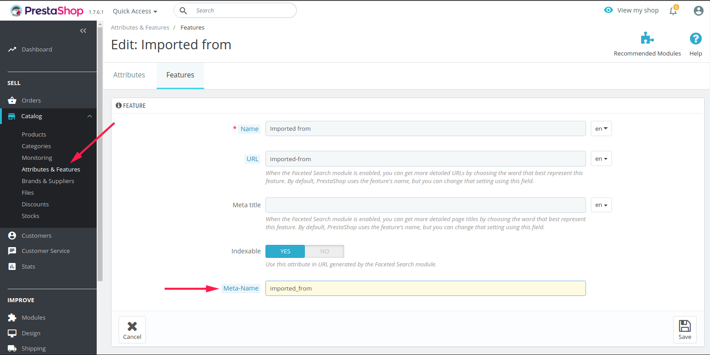
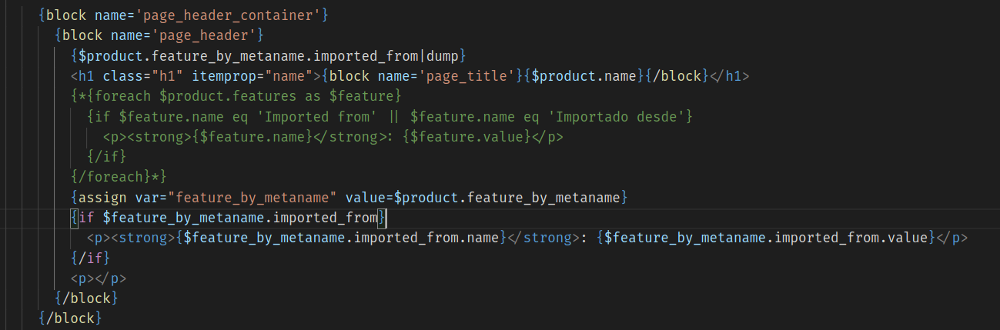

# Meta-Name Feature 

Este modulo añade un campo extra al formulario de creación/edición de Features (Características) en Prestashop, este campo se utiliza para definir un Meta-Name a cada Feature creado. Posteriormente estos **Features by Metaname** serán anexados en las variables globales de Smarty y estarán accesibles en plantillas asociadas a productos como el Listado de Productos (Pagina de Categoría), Pagina de Productos y Miniatura de Productos.

## ¿Para que necesito esto?

Lo primero que debes saber es que este modulo esta **completamente orientado a desarrolladores** de temas, para ofrecerles mas versatilidad, facilidad y solidez a la hora de añadir mas información en las paginas relacionadas con productos, específicamente si esta información se almacena en forma de Feature. A continuación se mostraran una serie de ejemplos prácticos donde este modulo podría ser de mucha utilidad.

Supongamos que un cliente exigente te ha solicitado que añadas un vistoso mensaje justo debajo del titulo en cada producto (en la pagina del producto), que indique a los compradores la procedencia de la tela con la que esta fabricado el producto, solo si este es importado, digamos que se trata de una nueva normativa  en el país local de nuestro cliente. En ese caso lo primero que se nos viene a la cabeza es crear una nueva Feature que nos permita guardar el país de procedencia de la tela, luego seguramente pensaríamos en asociar este Feature a cada producto que este fabricado con una tela importada.

Digamos que nuestro Feature se llama **“Importada desde”** y el valor puede ser el nombre de un país. ¿Todo bien no?.

Lo engorroso viene cuando nos toca añadir la lógica para mostrar este mensaje, no estamos diciendo que no puede, solo que es poco practico y para nada elegante.

Si suponemos que la tienda de nuestro cliente es multi-idioma, seguramente el cliente nos pedirá que el flamante mensaje (advertencia?) esté traducido para cada idioma en la tienda.

Si nos fijamos en como Prestashop anexa los Features en las variables o datos disponibles para la plantilla product.tpl (Pagina del Producto), veremos que estas se organizan listando los nombres de cada feature según el idioma actual establecido por el cliente.

Si quisiéramos acceder a esta información para poder determinar si un producto determinado aplica o no para mostrar la mensaje de **“Importado desde”**  tendríamos que recorrer el Array $product.features
para determinar si existe o no un Feature que tenga por nombre **“Importado desde”** o **“Imported from”**.

Ya podemos comenzar a vislumbrar el problema, es muy aparente que nuestro tema ahora depende de un una cadena (string) traducible que podría tener múltiples valores y toda clase caracteres “extraños” según el idioma que tenga. El verdadero problema viene si un día por algún motivo nuestro cliente modifica la traducción del Feature **“Importado desde”**, todo dejaría de funcionar al instante. Es por ello que jamas se recomienda comparar caracteres traducibles que sean muy propensos a cambios.

No temas, la ayuda esta en camino. Si decidimos tomar otro enfoque y utilizar el modulo **Meta-Name Feature** solo tendríamos que ingresar a la pagina de creación/modificación de nuestro Feature **“Importado desde”** y añadir un **Meta-Name**. Es importante que el texto que coloquemos aquí sea lo mas parecido al nombre una variable, es decir, sin caracteres extraños y con un nombre identificativo al feature al que esta asociado.

En nuestro caso será **“imported_from”**, ahora si internamos adaptar nuestro inseguro trozo de código anterior nos quedaría de la siguiente forma.

Como vemos el código ahora es mas limpio, seguro y matenible. Este mismo ejemplo podría aplicaría a el **Listado de Productos** o algún otro escenario donde se mostraran miniaturas de productos, es solo cuestión de imaginar.

## ¿Requerimientos del Modulo? 

Actualmente el modulo se encuentra en su fase inicial, de momento solo es compatible con versiones superiores de Prestashop 1.7.1.x.

## Reporta y Contribuye
La idea es ayudarnos entre todos, puedes reportar lo que no este bien o contribuir con soluciones utilizando los mecanismo que nos ofrece **Github**, adelante :).